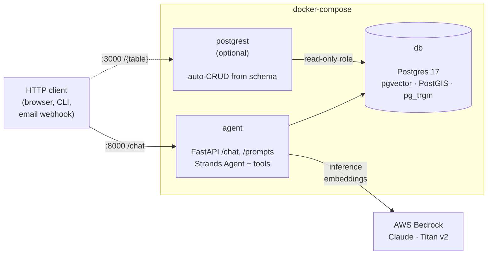
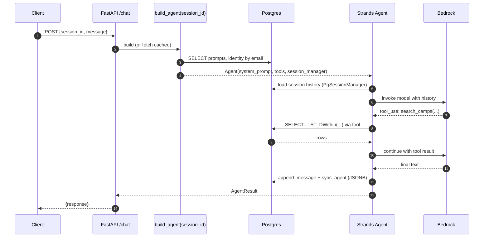

# strands-pg

Postgres-backed primitives for building purpose-built Strands agents.

> **What's Strands?** AWS's open-source Python SDK for building multi-turn
> LLM agents — [`strands-agents/sdk-python`](https://github.com/strands-agents/sdk-python).
> It's deliberately lean (small surface area, model-agnostic, no DSL or base
> class hierarchy to inherit from), which is exactly why this library pairs
> with it: `strands-pg` stays out of `Agent`'s way and just hands you
> implementations for the pieces that don't come in the box.

## What this is

`strands-pg` ships as a source stamp, not a package. You run a one-line
installer that copies the framework source and a starter agent shell into a
new directory, and from that point the code is yours — edit it, fork it,
delete the parts you don't need. There's no base class to extend, no runtime
to slot into, no predefined lifecycle, no pip dependency resolving a
registry in the background. Your agent is a regular `strands.Agent` that you
construct yourself; this library supplies Postgres-backed implementations of
the pieces every agent tends to need — session manager, memory store, prompt
store, identity store — and a few conveniences on top (a FastAPI factory,
a CLI, Docker images).

> **If you're running purely in AWS, look at Amazon Bedrock AgentCore first.**
> It's the first-party managed runtime for Strands agents — hosting, session
> persistence, memory, identity, and operational concerns are handled for you
> in AWS-managed infrastructure, and it's almost certainly the right choice if
> that's where your agent is going to live. `strands-pg` is for the cases
> AgentCore doesn't cover: self-hosting on your own VPS, on a Proxmox LXC, in
> a homelab, on a laptop, or anywhere else the agent needs to run outside an
> AWS-managed runtime. You still get Bedrock for inference and embeddings;
> you just own the rest of the stack.

It exists because any Strands agent — narrow specialist or general assistant —
eventually needs a handful of things beyond the LLM and its tools:

- Conversation state that survives a restart
- Long-term memory the agent can search semantically
- System prompts and per-user context that shouldn't be baked into source
- A place for domain data the tools query

In a typical build each of those lands in a different dependency: SQLite for
records, a vector database for memory, a dotted folder for session files,
another for prompts, a bespoke FastAPI to tie it together. Three days of
plumbing before the agent does its first useful thing. Most of that plumbing
is the same from one agent to the next, so writing it once is a good trade.

`strands-pg` puts all of it in one Postgres with pgvector, PostGIS, and pg_trgm,
and ships the Strands-specific glue that can't be expressed as a tool. The
thesis — one boring database with a few extensions replaces the polyglot
stack most agents accumulate — is cribbed from
[this "Postgres for everything" talk](https://www.youtube.com/watch?v=TdondBmyNXc);
watch that for the fuller argument. The wiring between Postgres and Strands
is the part worth writing once.

The primitives don't care about an agent's scope — a general-purpose assistant
benefits from durable sessions and per-user memory the same way a narrow
one-problem agent does. The *deployment pattern* (one Postgres co-located with
one agent, in one Docker Compose stack) is biased toward small agents — it
assumes a single database is plenty and you'd rather run ten of these than
scale one of them horizontally. See [What it doesn't do](#what-it-doesnt-do)
for where that bias bites.

Inference and embeddings go through **AWS Bedrock** by default — Claude
(Sonnet/Opus/Haiku) for the agent's reasoning, Titan Text Embeddings v2 for
memory vectors. Bedrock is the default because it keeps billing in one place
and avoids per-provider API key sprawl, but it's not load-bearing: pass any
Strands `Model` into `Agent(model=...)` and swap `PgMemoryStore(embedder=...)`
if you want OpenAI, Ollama, a local model, or anything else.

Four pieces do most of the heavy lifting — three extensions inside Postgres,
plus one sidecar service that lives beside it:

- **pgvector** — adds a `vector` column type and similarity-search operators
  (cosine distance, L2, inner product) plus HNSW and IVFFlat index types for
  fast approximate nearest-neighbor queries. Used here for semantic memory:
  you store an embedding per row, then `ORDER BY embedding <=> query_vec`.
- **PostGIS** — adds `geometry` and `geography` column types and a large
  library of spatial functions and GIST indexes: `ST_MakePoint`, `ST_DWithin`
  (points within *N* meters), `ST_Distance`, and so on. The `camping-db/`
  example uses it for "campsites within 30 miles of these coordinates."
- **pg_trgm** — trigram indexing for fuzzy text: `LIKE '%foo%'` becomes fast,
  `similarity()` gives a score, typos get tolerated. Complements tsvector
  full-text search — tsvector is stemmed word matching, pg_trgm is
  character-level fuzziness.
- **PostgREST** (sidecar, not an extension) — a small Haskell service that
  introspects the schema and auto-generates a filtered REST API from it.
  Grant `SELECT` on a table to a scoped role and it's immediately browsable
  at `/table_name?column=eq.value`; everything else stays invisible. Saves
  you from hand-rolling a FastAPI handler per table for admin/data CRUD.
  See the [Data APIs via PostgREST](#data-apis-via-postgrest) section below.

## How it fits together

At runtime, a deployed agent is three containers (two if you skip the admin
API) talking to Bedrock for inference and embeddings:



A `POST /chat` walks this path — prompts and identity come from the database
before the model sees anything, tool calls hit Postgres (and sometimes
external APIs), and the whole exchange is persisted as JSONB by
`PgSessionManager` so the next request picks up where this one left off:



## What's included

- `PgSessionManager` — a `SessionManager` subclass that persists conversations
  and agent state in Postgres JSONB. Pass it to `Agent(session_manager=...)` and
  history survives restarts.

- `PgMemoryStore` + `memory_tools(namespace=...)` — semantic memory on pgvector
  with HNSW indexing. The factory returns `[remember, recall]` closures bound
  to whatever namespace you pass (usually a session id or email), so every user
  gets an isolated memory bucket automatically.

- `PgPromptStore` — prompts live as rows in a `prompts` table. On first boot
  the store seeds itself from `./prompts/*.md`; after that the database is the
  source of truth, edited via API or SQL without rebuilding the image.

- `PgIdentity` — per-user profile documents keyed by slug, with a many-to-one
  email mapping (one user, multiple addresses). Typically loaded in your
  `build_agent()` and prepended to the system prompt.

- A migration runner (`python -m strands_pg.migrate`) that applies numbered
  SQL files in order. Framework migrations occupy 001–099; your agent's
  start at 100. No ORM, no Alembic. Called automatically by the container
  entrypoint on boot.

- `make_app(agent_factory)` — a FastAPI factory with `/health`, `/chat`, and
  optional `/prompts` endpoints. Convenience, not essence. Skip it if you have
  your own HTTP layer. Two additional opt-in features:
    - `make_app(..., deploy=True)` adds `POST /api/deploy` — writes a trigger
      file that a host-side systemd unit picks up. See "Deploy architecture"
      below.
    - `from strands_pg.agentmail import attach_email_webhook` — adds a
      `POST /api/webhook/email` handler with allowlist + echo-loop guards
      + prompt-injection for reply-via-MCP. See "Email agents" below.

- A chat CLI (`python -m strands_pg.cli`) that talks to `/chat` over HTTP.
  Useful for iterating on prompts and tools without building a frontend.

- Two Docker images: `strands-pg-db` (Postgres 17 + pgvector + PostGIS + pg_trgm)
  and `strands-pg-agent` (Python + Strands + this library + uvicorn, with an
  entrypoint that runs migrations on boot).

- An optional **PostgREST** sidecar pattern (shown in `camping-db/`). PostgREST
  is a standalone Haskell service that auto-generates a REST API from your
  database schema — filtered GET, JSON POST/PATCH/DELETE, OpenAPI spec, JWT
  auth — for the tables you explicitly grant to a scoped role. It's how
  `strands-pg` handles domain-data CRUD (`/camps`, `/parcel_services`, etc.)
  without reinventing a handler per table. `/chat` stays hand-written in
  FastAPI because PostgREST can't run an LLM; everything that's just tables
  delegates to PostgREST.

## A minimum working agent

```python
# app.py
from strands import Agent
from strands.models.bedrock import BedrockModel
from strands_pg import PgSessionManager, make_app, memory_tools

def build_agent(session_id: str) -> Agent:
    return Agent(
        model=BedrockModel(model_id="us.anthropic.claude-sonnet-4-5-20250929-v1:0"),
        system_prompt="You are a helpful assistant.",
        tools=memory_tools(namespace=session_id),
        session_manager=PgSessionManager(session_id=session_id),
    )

app = make_app(build_agent)
```

With `STRANDS_PG_DSN` pointing at a Postgres that has the framework migrations
applied, `uvicorn app:app` gives you an agent with per-user memory and durable
sessions at `POST /chat`. That's it.

## A realistic agent

Once you have domain data, the shape doesn't change much. You add migrations,
tools, prompt files, and a few identity profiles:

```text
my-agent/
├── app.py
├── prompts/
│   ├── soul.md               # seeded into DB on first boot
│   └── rules.md
├── identities/
│   └── brian.md              # YAML frontmatter + markdown body
├── migrations/
│   └── 100_orders.sql        # your domain tables
├── tools/
│   └── orders.py             # @tool search_orders, @tool create_order
├── Dockerfile
└── docker-compose.yml
```

`build_agent` pulls prompts and identity from the database, picks up the
per-session memory tools, and adds your domain tools:

```python
from strands import Agent
from strands.models.bedrock import BedrockModel
from strands_pg import (
    PgIdentity, PgPromptStore, PgSessionManager,
    make_app, memory_tools,
)
from tools.orders import search_orders, create_order

prompts = PgPromptStore();    prompts.seed_from_dir("./prompts")
identities = PgIdentity();    identities.seed_from_dir("./identities")

def build_agent(session_id: str) -> Agent:
    system_prompt = prompts.assemble(["soul", "rules"])
    identity = identities.get_by_email(session_id)
    if identity:
        system_prompt += f"\n\n## USER CONTEXT\n{identity.body}"

    return Agent(
        model=BedrockModel(model_id="us.anthropic.claude-sonnet-4-5-20250929-v1:0"),
        system_prompt=system_prompt,
        tools=[
            search_orders,
            create_order,
            *memory_tools(namespace=session_id),
        ],
        session_manager=PgSessionManager(session_id=session_id),
    )

app = make_app(build_agent, prompt_store=prompts)
```

Two worked examples live in the repo:

- `example/` — the minimum agent above, wrapped in a `docker-compose.yml` you
  can copy.
- `camping-db/` — a larger port of a real family-camping agent: 15,668 campsite
  records with PostGIS spatial search and tsvector full-text, two user
  identities mapped to multiple emails each, and five tools (`search_camps`,
  `get_campsite`, `geocode`, `land_ownership`, `parcel_lookup`). Runs on port
  8001 alongside `example/` on 8000, plus a PostgREST sidecar on 3000.

## Deploy architecture

Every strands-pg agent ends up needing a "git push → rebuild on the LXC"
webhook. We learned the hard way not to run that orchestration from
inside the container being rebuilt — docker kills the orchestrator
mid-command. The framework's default is **host-side orchestration**:

```text
 agent container              LXC host
 ----------------             -------------------------------------
 POST /api/deploy             <agent>-deploy.path (systemd)
   └► writes timestamp ────►  (PathModified on .deploy-trigger)
      to .deploy-trigger               │
      (via bind mount)                 ▼
                             <agent>-deploy.service
                               └► /opt/<agent>/deploy.sh
                                   git pull
                                   docker compose up -d --build
                               (runs on HOST, survives rebuild)
```

**Enable it** by passing `deploy=True` to `make_app(...)` and setting
two env vars in `.env`:

```text
DEPLOY_TOKEN=a-long-random-bearer-token
DEPLOY_TRIGGER=/opt/<your-agent>/.deploy-trigger
```

The systemd units are installed by `bootstrap-lxc.sh` from templates in
`templates/agent/systemd/*.in` — substituted at install time so two
agents on the same host get distinct unit names
(e.g. `camping-db-deploy.service` vs `mealie-deploy.service`).

**Debug a deploy:** `journalctl -u <agent>-deploy.service -n 100`.

**Anti-pattern to avoid:** mounting `/var/run/docker.sock` into the
agent container so it can run `docker compose` itself. Gives any process
in the container root-equivalent on the host, and fails the first time
docker rebuilds the container out from under the running script.

## Email agents

If your agent wants to serve email (via [AgentMail](https://agentmail.to)
or similar), the framework has a helper. It's **off by default** — you
only pay the MCP + webhook cost if you wire it in.

```python
from strands_pg import make_app, PgIdentity
from strands_pg.agentmail import attach_email_webhook, make_agentmail_mcp

identities = PgIdentity()
agentmail_mcp = make_agentmail_mcp()  # uses AGENTMAIL_API_KEY env var

def build_agent(session_id: str, extra_prompt: str = "") -> Agent:
    return Agent(
        system_prompt=_system_prompt_for(session_id, extra_prompt),
        tools=[
            *agentmail_mcp.list_tools_sync(),   # send/reply/threads
            *memory_tools(namespace=session_id),
            *your_domain_tools,
        ],
        session_manager=PgSessionManager(session_id=session_id),
    )

app = make_app(build_agent, prompt_store=prompts, deploy=True)
attach_email_webhook(
    app,
    build_agent=build_agent,
    known_emails=lambda: {e.lower() for i in identities.list() for e in i.emails},
    agentmail_address=os.environ["AGENTMAIL_ADDRESS"],
)
```

`attach_email_webhook` handles:
- event-type filter (`message.received` + its `.spam` / `.blocked` variants)
- sender allowlist via `known_emails`
- echo-loop prevention
- dedup by `message_id`
- agent processing in a background thread so the webhook returns fast
- prompt injection telling the model it MUST call `reply_to_message` on
  the MCP to actually send the reply (without this, you'll find the
  agent generates beautiful responses that go nowhere)

### Gotchas for email agents

- **AgentMail MCP auth uses `x-api-key`**, not `Authorization: Bearer`.
  `make_agentmail_mcp()` handles this. If you're wiring MCP manually and
  getting 401, this is why.
- **SPF + DKIM + DMARC on your sending domain are a prerequisite.** If
  you see every test email flagged as spam, run
  `dig TXT <your-domain>` and look for SPF/DMARC records. Missing auth
  records + sending via Gmail with a custom From → spam classifier
  fires, the `message.received` event never reaches your webhook.
- **The agent MUST call `reply_to_message` to send.** Writing a
  response as chat text goes nowhere — email is async. The prompt
  injection in `attach_email_webhook` makes this explicit, but if you
  customize the template, keep the directive.

## Data APIs via PostgREST

`make_app` handles the *agent* endpoint (`/chat`) and some admin plumbing
(`/prompts`). Anything else — listing/filtering/editing rows in your domain
tables — is delegated to [PostgREST](https://postgrest.org), mounted as a
third Docker service that points at the same database:

```yaml
postgrest:
  image: postgrest/postgrest:v12.2.0
  environment:
    PGRST_DB_URI: postgres://strands:strands@db:5432/strands
    PGRST_DB_SCHEMAS: public
    PGRST_DB_ANON_ROLE: web_anon
  ports: ["3000:3000"]
```

A small migration grants `web_anon` SELECT on the tables you want browsable:

```sql
CREATE ROLE web_anon NOLOGIN;
GRANT USAGE ON SCHEMA public TO web_anon;
GRANT SELECT ON TABLE camps, parcel_services TO web_anon;
GRANT web_anon TO strands;
```

You now have:

```bash
# Filtered GET with PostgREST's query syntax:
curl 'localhost:3000/camps?state=eq.MT&type=eq.NF&limit=5&select=camp,town,lat,lon'

# Row count via the Prefer header:
curl -I -H 'Prefer: count=exact' 'localhost:3000/camps?state=eq.MT'
# Content-Range: 0-552/553

# OpenAPI spec (Swagger 2.0 JSON, served at the root):
curl localhost:3000/
```

### Machine-readable schema at `GET /`

PostgREST serves a Swagger 2.0 document at its root path — no flag, no
separate `/openapi.json` convention, just `GET /`. It's the same spec as
the HTTP surface, regenerated from the live database schema. Two things
that matter:

- **Every exposed table shows up under `definitions`** with its columns,
  types, nullability, and primary key. After the `api`-schema cleanup
  above, `definitions` lists `camps` and `parcel_services` and nothing
  else.
- **Every endpoint shows up under `paths`** — `/camps`, `/parcel_services`,
  `/rpc/*` for any exposed DB functions. Unreachable paths (tables the
  requesting role can't touch) still appear; row-level permissions enforce
  what's actually allowed at request time.

This is the integration point for another agent or service that needs to
know what data is available without being hand-coded against it. A client
SDK generator (`openapi-generator`, `datamodel-code-generator`, etc.) can
turn `curl localhost:3000/` straight into typed models. An LLM-powered
agent can read the spec as context and construct queries on the fly.

```bash
# Example: grab just the table names this PostgREST instance exposes:
curl -s localhost:3000/ | jq -r '.definitions | keys[]'
# camps
# parcel_services
```

No Swagger UI renderer ships with PostgREST — the JSON is the product. If
you want a browsable view, point any OpenAPI UI at the URL.

Tables that aren't granted to `web_anon` stay invisible — `sessions`,
`session_messages`, `memories`, `identities`, and `prompts` never leak out
this surface. Skip the compose block entirely if you don't want an admin
API; the agent works the same either way.

### Keep PostGIS out of your OpenAPI doc

PostGIS installs roughly 250 `ST_*` functions into `public`. If PostgREST is
pointed at `public`, every one shows up in the auto-generated OpenAPI spec as
an unreachable `/rpc/st_*` endpoint, which drowns out your real tables. The
standard fix is to put agent-owned tables in a dedicated schema and point
PostgREST there. In `camping-db/migrations/103_api_schema.sql`:

```sql
CREATE SCHEMA IF NOT EXISTS api;

ALTER TABLE public.camps            SET SCHEMA api;
ALTER TABLE public.parcel_services  SET SCHEMA api;

-- unqualified FROM clauses in tool SQL still resolve without code changes
ALTER ROLE strands SET search_path = api, public;

GRANT USAGE ON SCHEMA api TO web_anon;
-- SELECT grants follow the tables via SET SCHEMA
```

Matching compose env:

```yaml
PGRST_DB_SCHEMAS: api
PGRST_DB_EXTRA_SEARCH_PATH: "api, public"
```

After this, `curl localhost:3000/` returns just `camps` and `parcel_services`
under `definitions` and zero `/rpc/*` entries. PostGIS stays in `public` where
the tool SQL can still reach it (`ST_DWithin`, `ST_MakePoint`, etc.) without
being exposed to the HTTP surface. The migration also adds a DDL event trigger
that fires `NOTIFY pgrst, 'reload schema'` after any schema change, so you
don't need to `docker restart postgrest` every time a new migration lands.

Framework tables (`sessions`, `memories`, `prompts`, `identities`) stay in
`public` — they're never exposed to PostgREST anyway, and moving them would
churn the session-manager code for no benefit.

## What it doesn't do

- **No horizontal scaling.** One Postgres per agent, one agent per container.
  If your agent outgrows a single Postgres, you've outgrown this library.
- **No cross-agent multi-tenancy.** Each agent has its own database. If two
  agents need to share data, that's an explicit choice you make.
- **No deployment layer.** Docker images are provided; how and where you run
  them is up to you. The author happens to run each agent in its own Proxmox
  LXC.
- **Not a replacement for Strands tools.** `memory_tools` is the only piece
  exposed as tools. Everything else is lifecycle/plumbing that couldn't be
  tools if it tried.
- **No agent-authoring DSL or no-code builder.** You write Python.

## Install

You don't. There's no package to install. This project follows the
[shadcn/ui](https://ui.shadcn.com/) distribution model — a one-shot bash
installer copies the framework source into your new agent directory, and
from that point **you own every file**. No `pip install strands-pg`, no
runtime dependency on this repo, no surprise updates pulling in something
you didn't vet.

Why this matters: pip and npm have become supply-chain liabilities. Every
`pip install` resolves transitive dependencies from a registry that could
(and occasionally does) serve you compromised code. Copying a pinned
release once, reviewing it, and owning it is a narrower attack surface.

```bash
# Latest tagged release:
curl -sSL https://raw.githubusercontent.com/peterb154/strands-pgsql-agent-framework/main/install.sh \
  | bash -s -- my-agent

# Pinned version (recommended — both installer and framework locked to v0.1.0):
curl -sSL https://raw.githubusercontent.com/peterb154/strands-pgsql-agent-framework/v0.1.0/install.sh \
  | bash -s -- my-agent --ref v0.1.0

# Paranoid mode — inspect before running:
curl -sSL https://raw.githubusercontent.com/peterb154/strands-pgsql-agent-framework/main/install.sh -o install.sh
less install.sh
bash install.sh my-agent
```

What lands in `my-agent/`:

```text
my-agent/
├── strands_pg/          # vendored framework source — yours to edit
├── migrations/          # framework 001-003 SQL; add your 100+ here
├── prompts/             # soul.md + rules.md starters, seeded into DB
├── tools/               # your domain @tool functions go here
├── db/Dockerfile        # Postgres 17 + pgvector + PostGIS
├── Dockerfile           # python:3.13 + your app
├── docker-compose.yml   # agent + db; optional PostgREST block (commented)
├── entrypoint.sh        # waits for PG, applies migrations, execs uvicorn
├── app.py               # the Agent you build — start editing here
├── requirements.txt
├── .env.example
└── README.md            # quickstart for this stamped agent
```

Run it:

```bash
cd my-agent
cp .env.example .env     # edit AWS_PROFILE to one with Bedrock access
docker compose up --build
curl -s localhost:8000/health
```

## Updating

To bump the framework on an existing agent without touching your templates:

```bash
bash install.sh my-agent --refresh --ref v0.7.0
```

`--refresh` only rewrites `strands_pg/` and the framework-numbered migrations
(`migrations/0*.sql`). Your `app.py`, `tools/`, `prompts/`, `Dockerfile`,
`docker-compose.yml`, etc. are left alone.

If you want a full re-stamp (accepting that templated files will be
overwritten):

```bash
bash install.sh my-agent --force --ref v0.7.0
```

`my-agent/.strands-pg-ref` records which version you stamped from originally.
When in doubt, diff a fresh stamp against your tree:

```bash
bash install.sh /tmp/fresh-stamp --ref v0.7.0
diff -r /tmp/fresh-stamp my-agent
```

## Deployment gotchas

A few things that aren't framework bugs but that have bitten real agents
on real deployments. Worth knowing before you spend an hour tracing a
symptom.

**Nginx sub_filter + `location`-scope inheritance.** If you inject a
`<script>` tag into an upstream's HTML via Nginx Proxy Manager's Advanced
tab — the classic "drop a floating button into Mealie" pattern — note that
NPM places Advanced directives at `server` scope, but its generated
`location /` has its own `proxy_set_header` directives. Per nginx rules,
any `proxy_set_header` in a location block **replaces** all inherited
ones, so your `Accept-Encoding ""` reset silently never reaches the
upstream and `sub_filter` sits idle on gzipped bytes. Symptoms: the
`<script>` tag isn't in the rendered HTML even though your config looks
right, and the upstream keeps returning `Content-Encoding: gzip`.

Fix: edit the generated `/data/nginx/proxy_host/*.conf` file directly to
add `proxy_set_header Accept-Encoding "";` *inside* `location /`. See
[`local_network/npm/`](https://github.com/peterb154/local_network/tree/main/npm)
for an idempotent patch-script pattern that survives NPM UI edits.

**Commit SHA in `/api/health` needs a rebuild, not just a restart.** If
you pass `health_info=lambda: {"commit": os.environ["GIT_SHA"]}` to
`make_app`, the value comes from a docker build arg that deploy.sh sets
before `docker compose up -d --build`. A `docker restart` without
`--build` keeps the old SHA. Use `commit_sha()` as a fallback when you
bind-mount the repo into the container — it reads `.git/HEAD` off the
mount.

**SSE responses through nginx.** `make_app` already sets
`X-Accel-Buffering: no` and `Cache-Control: no-transform` on
`/chat/stream`, so nginx shouldn't buffer. If you see streaming hang or
arrive in one chunk, check whether a different proxy (Cloudflare,
CloudFront, corporate squid) is in the path — those can re-compress or
buffer independently.

## Status

Pre-1.0. The primitives above work end-to-end and have been used to port a
real agent (`camping-db/`). The API will shift as more agents are built on it;
the `PgSessionManager` contract and the migration-numbering convention
(framework 001–099, agents 100+) are stable.

## License

MIT.
